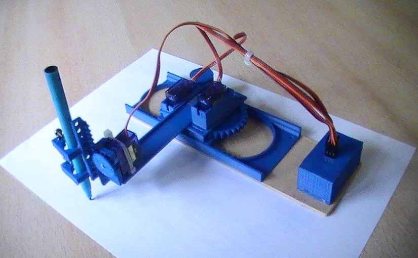
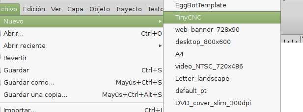
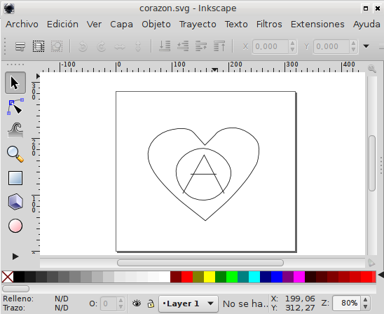
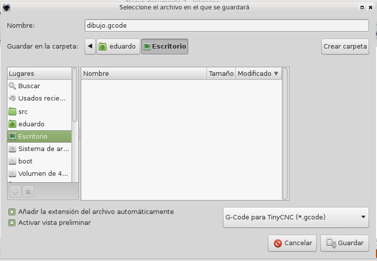
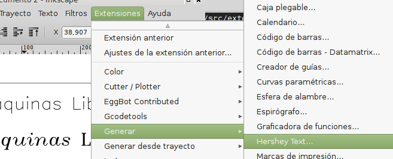
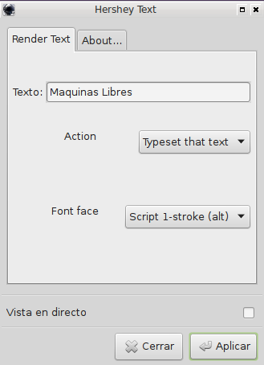

G-Code de TinyCNC para Inkscape
===============================

Extensión de inkscape para exportar codigo G-Code para TinyCNC

[Comprar una](https://maquinaslibres.noblogs.org/tinycnc/)

Instalar
========

[Descargar la extensión](https://github.com/maquinas-libres/inkscape-tinycnc/archive/master.zip) expandir y copiar la extensión y templates en inkscape:

* GNU/Linux - `/usr/share/inkscape/extensions` o `~/.config/inkscape/`
* OS X - `/Applications/Inkscape.app/Contents/Resources/`
* Windows - `C:\Program Files\Inkscape\share\`

GNU/Linux
---------

~~~
wget https://raw.githubusercontent.com/maquinas-libres/inkscape-tinycnc/master/instalar.sh | bash
~~~

Iniciar inkscape y ahora inicia con la opción para salvar como "G-Code para TinyCNC"

Uso
===

> Al abrir el inkscape elegí **Nuevo** → **TinyCNC** esto va a mostrarnos el area dibujable por el tinycnc

> Dibuja lo que quieras :D

> Grabalo como "G-Code para TinyCNC"

Una vez obtenido el G-Code vamos a tener que usar un programa para comunicarnos con la impresora por ahora el más recomendable es [cncgcodecontroller](...)

Texto para dibujar
------------------

Para imprimir texto con la tinyCNC es preferible usar fuentes formadas con pocas lineas, para eso podemos usar la extension "Hershey Text" incluida en esta instalación.

Elegimos la extensión

Escribimos lo que queramos, elegimos la fuente y aceptamos

Vemos el texto listo para imprimir.

Creditos
========

* [Marty McGuire](http://github.com/martymcguire) pulled this all together into an Inkscape extension.
* [Inkscape](http://www.inkscape.org/) is an awesome open source vector graphics app.
* [Scribbles](https://github.com/makerbot/Makerbot/tree/master/Unicorn/Scribbles%20Scripts) is the original DXF-to-Unicorn Python script.
* [The Egg-Bot Driver for Inkscape](http://code.google.com/p/eggbotcode/) provided inspiration and good examples for working with Inkscape's extensions API.
* [Hershey Text](http://www.evilmadscientist.com/2011/hershey-text-an-inkscape-extension-for-engraving-fonts/) para las fuentes lineales

Quehaceres
==========

* Más ejemplos
* Conversor de pixels a vectores (eggbot)
